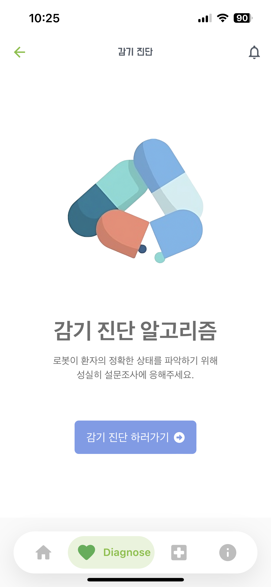
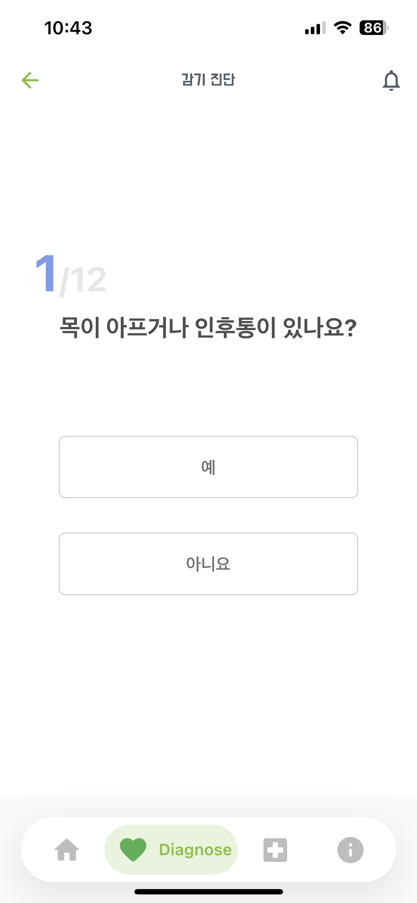
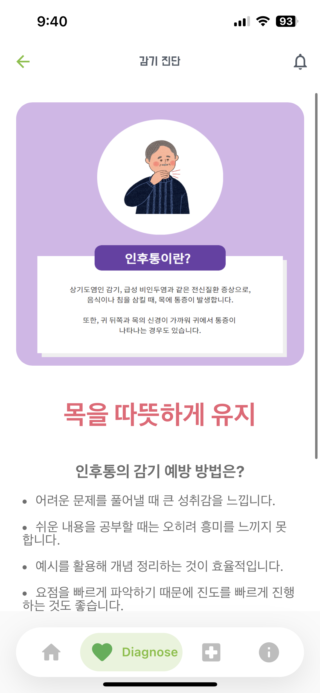
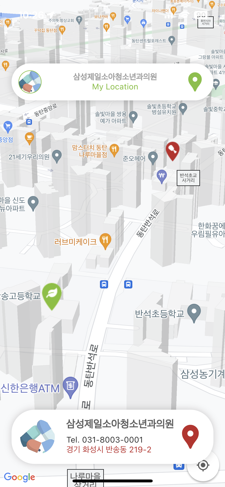
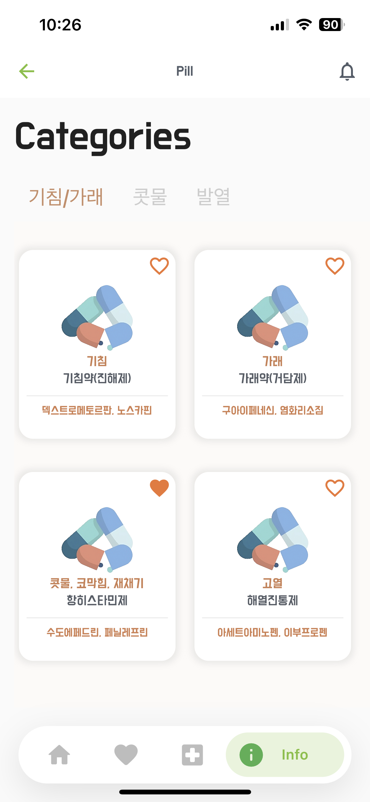

# 돌아다니는 로봇 의사 "무빙이" 전용 앱

## 연구 동기
2023년도 자율 교육 과정에서 우리는 지속 가능한 미래를 위한 도시를 구축하기 위해 돌아다니는 로봇 의사를 생각해냈다.
스마트 시티에서 인간, 환경, 기술... 지속 가능한 미래를 구현하기 위해 고민했다. 도시가 존재하려면 먼저 시민들이 있어야하고 시민들이 도시에서 풍요롭게 살기 위해선 시민들의 건강이 먼저 떠올랐다. 필자는 미국에서 살아본 경험이 있다. 미국에서 거주할 때 도시에 인간다운 삶을 권장받지 못하는 사람들이 있었다. 일명 거지 타운이라고 그런 곳이 많았다. 자고로 지속 가능한 미래를 구축하기 위해 그런 사람들은 없어야 한다고 생각한다. 따라서 이 로봇 의사는 의료 진료를 받기 힘든 사람, 바쁜 현대인들을 위해 간단히 진료를 받을 수 있게끔 하는 것이 우리 팀의 목적이다.

## 연구 목적
인공지능과 로봇 기술을 활용하여 돌아다니는 로봇 의사 시스템을 개발하고 의료진단 과 처방들을 수행할 수 있는 다양한 의료 서비스를 제공할 수 있는 기능을 탑재하고 지속 가능한 스마트 시티 구축을 위한 도시 건강 개선을 위해 돌아다니는 로봇 의사를 활용하여 도시 주민들의 의료 접근성 향상 및 건강 관리를 지원하고 거지 타운과 같은(비록 몇몇 국가들은 없을 수 있지만) 곳에 사회적 약자들의 의료 서비스 제공과 사회적 표용을 촉진하고, 응급 상황에서도 신속한 응급 처치를 할 수 있게끔 하여 응급 상황에서의 사망률 및 합병증 발생률을 감소할 수 있도록 한다. 또한 돌아다니는 로봇 의사 시스템을 스마트 시티 인프라와 통합하여 원활한 운영과 데이터 관리를 가능하게 함으로써 유비쿼터스 마을을 구축할 수 있다. 또한 돌아다니는 로봇 의사 운영에 필요한 윤리적인 가이드 라인을 마련하고 개인 정보 보호 및 의료 정보의 안전한 관리를 위한 보안 시스템을 구축해야한다.


## 사용 스택

1. 아두이노
   ``
   돌아다니는 로봇 의사에 목적에 맞게 움직일 수 있게 만든 아두이노 자동차
   ``

   ```c
   #define enA 10//Enable1 L298 Pin enA 
   #define in1 9 //Motor1  L298 Pin in1 
   #define in2 8 //Motor1  L298 Pin in1 
   #define in3 7 //Motor2  L298 Pin in1 
   #define in4 6 //Motor2  L298 Pin in1 
   #define enB 5 //Enable2 L298 Pin enB 

   #define L_S A0 //ir sensor Left
   #define R_S A1 //ir sensor Right

   #define echo A2    //Echo pin
   #define trigger A3 //Trigger pin

   #define servo A5

   int Set=15;
   int distance_L, distance_F, distance_R; 

   void setup(){ // put your setup code here, to run once

     Serial.begin(9600); // start serial communication at 9600bps

     pinMode(R_S, INPUT); // declare if sensor as input  
     pinMode(L_S, INPUT); // declare ir sensor as input

     pinMode(echo, INPUT );// declare ultrasonic sensor Echo pin as input
     pinMode(trigger, OUTPUT); // declare ultrasonic sensor Trigger pin as Output  

     pinMode(enA, OUTPUT); // declare as output for L298 Pin enA 
     pinMode(in1, OUTPUT); // declare as output for L298 Pin in1 
     pinMode(in2, OUTPUT); // declare as output for L298 Pin in2 
     pinMode(in3, OUTPUT); // declare as output for L298 Pin in3   
     pinMode(in4, OUTPUT); // declare as output for L298 Pin in4 
     pinMode(enB, OUTPUT); // declare as output for L298 Pin enB 

     analogWrite(enA, 200); // Write The Duty Cycle 0 to 255 Enable Pin A for Motor1 Speed 
     analogWrite(enB, 200); // Write The Duty Cycle 0 to 255 Enable Pin B for Motor2 Speed 

     pinMode(servo, OUTPUT);

    for (int angle = 70; angle <= 140; angle += 5)  {
      servoPulse(servo, angle);  }
    for (int angle = 140; angle >= 0; angle -= 5)  {
      servoPulse(servo, angle);  }

    for (int angle = 0; angle <= 70; angle += 5)  {
      servoPulse(servo, angle);  }

       distance_F = Ultrasonic_read();

     delay(500);
   }


   void loop(){  
   //==============================================
   //     Line Follower and Obstacle Avoiding
   //==============================================  

   distance_F = Ultrasonic_read();
   Serial.print("D F=");Serial.println(distance_F);


   //if Right Sensor and Left Sensor are at White color then it will call forword function
    if((digitalRead(R_S) == 0)&&(digitalRead(L_S) == 0)){
     if(distance_F > Set){forword();}
                     else{Check_side();}  
    }  
 
     //if Right Sensor is Black and Left Sensor is White then it will call turn Right function
   else if((digitalRead(R_S) == 1)&&(digitalRead(L_S) == 0)){turnRight();}  
   
   //if Right Sensor is White and Left Sensor is Black then it will call turn Left function
   else if((digitalRead(R_S) == 0)&&(digitalRead(L_S) == 1)){turnLeft();} 
    
   delay(10);
   }

   void servoPulse (int pin, int angle){
     int pwm = (angle*11) + 500;      // Convert angle to microseconds
       digitalWrite(pin, HIGH);
       delayMicroseconds(pwm);
       digitalWrite(pin, LOW);
       delay(50); // Refresh cycle of servo
   }


   //**********************Ultrasonic_read****************************
   long Ultrasonic_read(){
     digitalWrite(trigger, LOW);
     delayMicroseconds(2);
     digitalWrite(trigger, HIGH);
     delayMicroseconds(10);
     long time = pulseIn (echo, HIGH);
     return time / 29 / 2;
   }

   void compareDistance(){
       if(distance_L > distance_R){
     turnLeft();
     delay(500);
     forword();
     delay(600);
     turnRight();
     delay(500);
     forword();
     delay(600);
     turnRight();
     delay(400);
     }
     else {
     turnRight();
     delay(500);
     forword();
     delay(600);
     turnLeft();
     delay(500);
     forword();
     delay(600);  
     turnLeft();
     delay(400);
     }
   }

   void Check_side(){
       Stop();
       delay(100);
     for (int angle = 70; angle <= 140; angle += 5)  {
      servoPulse(servo, angle);  }
       delay(300);
       distance_R = Ultrasonic_read();
       Serial.print("D R=");Serial.println(distance_R);
       delay(100);
     for (int angle = 140; angle >= 0; angle -= 5)  {
      servoPulse(servo, angle);  }
       delay(500);
       distance_L = Ultrasonic_read();
       Serial.print("D L=");Serial.println(distance_L);
       delay(100);
    for (int angle = 0; angle <= 70; angle += 5)  {
      servoPulse(servo, angle);  }
       delay(300);
       compareDistance();
   }

   void forword(){  //forword
     digitalWrite(in1, LOW); //Left Motor backword Pin 
     digitalWrite(in2, HIGH); //Left Motor forword Pin 
     digitalWrite(in3, HIGH); //Right Motor forword Pin 
     digitalWrite(in4, LOW); //Right Motor backword Pin 
   }         

   void backword(){ //backword
     digitalWrite(in1, HIGH); //Left Motor backword Pin 
     digitalWrite(in2, LOW); //Left Motor forword Pin 
     digitalWrite(in3, LOW); //Right Motor forword Pin 
     digitalWrite(in4, HIGH); //Right Motor backword Pin 
   }   

   void turnRight(){ //turnRight
     digitalWrite(in1, LOW); //Left Motor backword Pin 
     digitalWrite(in2, HIGH); //Left Motor forword Pin 
     digitalWrite(in3, LOW); //Right Motor forword Pin 
     digitalWrite(in4, HIGH); //Right Motor backword Pin 
   }

   void turnLeft(){ //turnLeft
     digitalWrite(in1, HIGH); //Left Motor backword Pin 
     digitalWrite(in2, LOW); //Left Motor forword Pin 
     digitalWrite(in3, HIGH); //Right Motor forword Pin 
     digitalWrite(in4, LOW); //Right Motor backword Pin 
   }

   void Stop(){ //stop
     digitalWrite(in1, LOW); //Left Motor backword Pin 
     digitalWrite(in2, LOW); //Left Motor forword Pin 
     digitalWrite(in3, LOW); //Right Motor forword Pin 
     digitalWrite(in4, LOW); //Right Motor backword Pin 
   }
   ```


3. React Js

 ``
감기 진단 알고리즘을 제작하였고, 앱 내의 Diagnose Page를 웹 뷰를 통해 구현함
``


<figure class="thrid">
  <a href="link"></a>
  <a href="link"></a>
  <a href="link"></a>
</figure>
 
4. Flutter
  ``
   돌아다니는 로봇 의사 "무빙이" 전용 앱을 만들 때 사용한 프레임 워크
   ``

 <figure>
  <a href="link"></a>
  <a href="link"></a>
  <a href="link"></a>
  <a href="link"></a>
  <a href="link"></a>
  <a href="link"></a>
</figure>  

A few resources to get you started if this is your first Flutter project:

- [Lab: Write your first Flutter app](https://docs.flutter.dev/get-started/codelab)
- [Cookbook: Useful Flutter samples](https://docs.flutter.dev/cookbook)

For help getting started with Flutter development, view the
[online documentation](https://docs.flutter.dev/), which offers tutorials,
samples, guidance on mobile development, and a full API reference.
